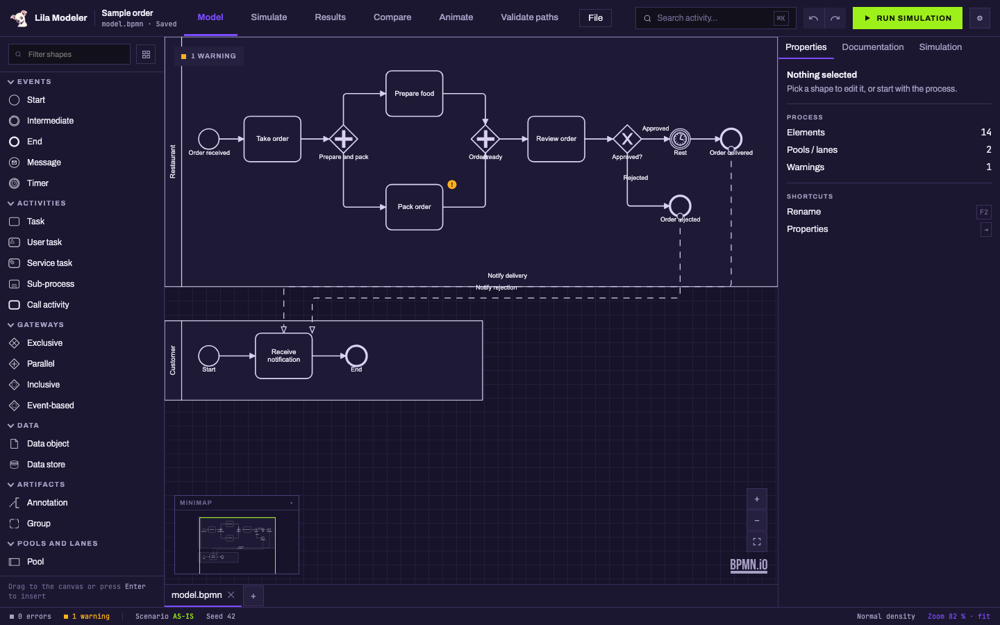

<p align="center"></p>

<p align="center">Simulación de eventos discretos open source para procesos BPMN — en el navegador, en el escritorio, desde la CLI o por MCP.</p>

<p align="center">
  <a href="https://alambritodito.github.io/lila-modeler/app/"></a>
  <a href="https://github.com/AlambritoDito/lila-modeler/releases/tag/v1.0.0-beta.1"></a>
  <a href="docs/"></a>
  <a href="docs/es/COMING-FROM-BIZAGI.md"></a>
  <a href="https://github.com/AlambritoDito/lila-modeler/actions/workflows/ci.yml"></a>
  <a href="LICENSE"></a>
</p>

Leer en: [English](README.md)

## Qué es Lila Modeler

Lila Modeler es un motor de simulación de eventos discretos (DES) para procesos BPMN. Dibujas el
proceso, describes un escenario (llegadas, tiempos de proceso, recursos, calendarios, costos), lo
corres con replicaciones, lees tablas de resultados al estilo Bizagi y comparas escenarios lado a
lado. Está inspirado en el flujo de simulación de Bizagi Modeler y validado contra sus ejemplos
públicos documentados; no es un sustituto directo (ver
[Cómo se compara](#cómo-se-compara-con-bizagi-modeler)).

El núcleo del motor no tiene dependencias y corre igual en Node, en un Web Worker del navegador y
detrás de un servidor MCP. Los contratos —el IR del proceso, el formato de escenario y el de
resultados— están documentados en [`docs/`](docs/) antes que el código, y son la parte del
proyecto que se mantiene estable.



## Funciones

- **Seis modos en una ventana** — Modelar, Simular, Resultados, Comparar, Animar y Validar rutas.
- **Simular en cuatro pasos** — validación del proceso, análisis de tiempos, de recursos y de
  calendarios: los cuatro niveles de Bizagi, en el mismo orden y con el mismo vocabulario.
- **Distribuciones** — las 13 de BPSim 2.0 (incluida la empírica) más la constante.
- **Replicaciones con intervalo de confianza del 95 %**, siempre; con semilla, las corridas son
  deterministas byte a byte.
- **Recursos y calendarios** — pools con capacidad, costo fijo y por hora; calendarios semanales con
  capacidad por turno; «Asignar carril» rellena los recursos de todas las tareas de un carril de una
  vez.
- **Enrutamiento según el resultado previo del caso** — `conditions: [{ flowTaken, probability }]`
  en los flujos de una compuerta exclusiva.
- **Timers de borde interruptores** sobre tareas (primer corte).
- **Resultados** — los nombres de columna de Bizagi más las extras de Lila: p50/p90/p95, longitud
  de cola, throughput, costo por caso, ranking de cuellos de botella, espera fuera de horario
  separada de la espera por recurso. Exportación a CSV y XLSX.
- **Comparar** — dos o más escenarios con deltas por métrica y marca de significancia (IC 95 % sin
  solape).
- **Animar** — reproduce el log de eventos de la corrida sobre el diagrama con contadores por elemento y
  puntos en los flujos; sin volver a simular.
- **Validar rutas** — la animación didáctica de tokens de `bpmn-js-token-simulation`; no lee el
  escenario ni produce resultados.
- **Archivo de proyecto `.lila`** — la carpeta de proyecto zipeada. Guardar/abrir desde la app web
  (descarga), doble clic en el escritorio.
- **Temas** — `eva-01` (oscuro, por defecto), `papel` (claro), `tieso` (claro, azules del ITESO), `akira` (oscuro, Neo-Tokio) y `montana` (morado, rosa chicle y dorado, inspirado en Hannah Montana Linux), archivos JSON.
- **Inglés y español** en la app, la CLI y el servidor MCP.
- **Pantalla de bienvenida de escritorio** con proyectos recientes (solo Electron).
- **Servidor MCP** con cinco tools, para que un agente valide, describa, corra, compare y parchee.

## Inicio rápido

### Web

Abre [alambritodito.github.io/lila-modeler/app/](https://alambritodito.github.io/lila-modeler/app/).
Arranca con el ejemplo del restaurante (`examples/pedido`) cargado. **Archivo ▸ Guardar** (tooltip:
Guardar proyecto) descarga un `.lila` y conserva una copia en el navegador para restaurarla al
recargar; no se sube nada a ningún sitio.

### Compartir un proyecto con un colega

Compartir es pasar un archivo `.lila` portable, no edición simultánea — no hay cuenta, backend ni
sincronización en tiempo real. Usa **Archivo ▸ Guardar** (web, tooltip: Guardar proyecto) o
**Guardar como…** (escritorio) para obtener un `.lila`, envíalo como enviarías cualquier archivo,
y tu colega lo abre con **Archivo ▸ Abrir** (tooltip: Abrir proyecto) en la demo web o la app de
escritorio, o con doble clic en el Finder (verificado para la Beta 1: `<VERIFY-FINDER>`).
¿Encontraste un problema reproducible en el camino?
[Abre un issue](https://github.com/AlambritoDito/lila-modeler/issues/new/choose)
— la plantilla de bug pide un archivo `.bpmn` mínimo o un escenario que lo muestre.

### Beta de escritorio

La Beta 1 adjunta un solo instalador al release: `Lila-Modeler-1.0.0-beta.1-mac-arm64.dmg` para
macOS en Apple Silicon, más un archivo `SHA256SUMS` para verificarlo —
[Beta 1 en GitHub Releases](https://github.com/AlambritoDito/lila-modeler/releases/tag/v1.0.0-beta.1)
(no `/releases/latest`: GitHub excluye los prereleases de ese enlace). **No está firmada ni
notarizada**, así que el primer arranque se bloquea. Tras el primer intento bloqueado (doble clic
en la app), ve a **Ajustes del Sistema ▸ Privacidad y seguridad** y pulsa **Abrir de todas formas**
junto al mensaje que nombra la app, luego confirma **Abrir**. En macOS más antiguo, Control-clic
sobre la app ▸ **Abrir** ▸ **Abrir** funciona directamente. No desactives Gatekeeper para evitar
esto. `<VERIFY-GATEKEEPER>`
[`docs/es/GUIA-BETA-MAC.md`](docs/es/GUIA-BETA-MAC.md) explica el flujo completo, incluida la
verificación del checksum.

CI también construye instaladores de Windows (`.exe`) y Linux (`.AppImage`), pero son artefactos
de CI sin probar, no forman parte del release de la Beta 1. La app de escritorio se registra como
editor de archivos `.bpmn` y `.lila`.

### CLI

Requiere Node.js **22 o superior**. Todavía no se publica nada en npm: la CLI sale de un clon.

```bash
git clone https://github.com/AlambritoDito/lila-modeler.git
cd lila-modeler
npm ci
npm run build
```

`npx lila` resuelve el binario del propio workspace (`packages/engine/bin/lila.js`), sin consultar
el registro. Tres comandos sobre el benchmark de referencia:

1. Validar el modelo:

```bash
npx lila validate examples/pedido/model.bpmn
```

2. Simular el escenario AS-IS: tablas en stdout + JSON + CSV + XLSX:

```bash
npx lila run \
  examples/pedido/model.bpmn examples/pedido/as-is.scenario.json \
  --seed 42 --replications 3 \
  --json out/result.json --csv out/csv --xlsx out/as-is.xlsx
```

3. Comparar AS-IS contra TO-BE (un cajero más) lado a lado:

```bash
npx lila compare \
  examples/pedido/model.bpmn \
  examples/pedido/as-is.scenario.json examples/pedido/to-be-3-cajeros.scenario.json \
  --seed 42 --replications 3
```

```
Compared scenarios
#  Name              File                                           Seed  Replications
-  ----------------  ---------------------------------------------  ----  ------------
0  AS-IS (base)      examples/pedido/as-is.scenario.json            42    3
1  TO-BE 3 cashiers  examples/pedido/to-be-3-cajeros.scenario.json  42    3

Process elements
Id                Name        Metric                               AS-IS (base)  TO-BE 3 cashiers
...
Task_TomarPedido  Take order  Average time (waiting for resource)  0.234564      0.0344 (-85.334633%)*
```

`--json` y `--xlsx` funcionan en `run` y en `compare`; `--csv` solo en `run`; `--all` muestra
todas las métricas en `compare`. `--lang en|es` (en cualquier posición) elige el idioma de la
salida; `--help` en cualquier subcomando lista las opciones. Formatos:
[`docs/es/SCENARIO_FORMAT.md`](docs/es/SCENARIO_FORMAT.md),
[`docs/es/RESULTS_FORMAT.md`](docs/es/RESULTS_FORMAT.md).

### MCP

`lila mcp` arranca un servidor MCP por stdio con cinco tools sobre el mismo motor:
`validate_bpmn`, `describe_process`, `run_simulation`, `compare_scenarios`, `patch_scenario`.

```bash
claude mcp add lila -- node /ruta/a/lila-modeler/packages/engine/bin/lila.js mcp
```

El repo trae un `.mcp.json` de proyecto, así que abrir Claude Code en la raíz del repo registra el
servidor solo. Contratos de cada tool y límites conocidos (sin cancelación; todo I/O contra el
disco del servidor) en [`docs/es/MCP.md`](docs/es/MCP.md).

## Cómo se compara con Bizagi Modeler

Lila reproduce el flujo de simulación de Bizagi y contrasta sus números con los cuatro ejemplos
que Bizagi publica (niveles 1–4) con una tolerancia de ±5 %
([test](packages/engine/test/bizagi-parity.test.ts)). Es un criterio interno de validación, no una
promesa de paridad: el checklist completo, con cada diferencia documentada y su causa, está en
[`docs/es/BIZAGI_PARITY.md`](docs/es/BIZAGI_PARITY.md); el mapa pantalla por pantalla para
usuarios, en [`docs/es/COMING-FROM-BIZAGI.md`](docs/es/COMING-FROM-BIZAGI.md).

| Capacidad | Bizagi Modeler | Lila Modeler |
|---|---|---|
| Cuatro niveles: validación, tiempos, recursos, calendarios | ✓ | ✓ como los cuatro pasos de Simular; sin recursos ⇒ capacidad infinita, sin calendario ⇒ 24×7 |
| Distribuciones | subconjunto no documentado | las 13 de BPSim 2.0 (incl. empírica) + constante |
| Replicaciones y determinismo | replicaciones solo en what-if; semilla parcial | siempre, con IC 95 %; determinista byte a byte |
| Comparación what-if | ✓ | ✓ modo Comparar y `lila compare`, con deltas y marca de significancia |
| Exportación de resultados | Excel | CSV y XLSX |
| Percentiles, longitud de cola, throughput, costo por caso, ranking de cuellos, espera fuera de horario | ✗ | ✓ |
| Animación con contadores en vivo | ✓ | ✓ Animar reproduce el log de eventos |
| Plataformas | solo Windows | app web, macOS, Windows, Linux |
| Importar un `.bpmn` de Bizagi | — | solo el diagrama: Bizagi no exporta sus parámetros de simulación |
| Publicación de documentos (Word/PDF/web) | ✓ | ✗ no es una suite de documentación |
| Compuerta basada en eventos (ramas de tiempo y de mensaje) | ✓ | ✓ gana la primera rama que vence |
| Eventos de mensaje/señal/enlace sueltos | parcial | ✗ error de validación explícito |
| Multi-instancia, compuerta compleja, coreografía | ✗ | ✗ fuera de alcance |

### Límites conocidos

- **Perfil BPMN soportado**: start/end (none y terminate), timer intermedio, timer de borde
  (interruptor o no), compuerta basada en eventos con ramas de tiempo o de mensaje, tareas (todas
  las variantes), call activity, subproceso embebido, compuertas XOR/OR/AND, lanes y pools. Lo demás es un error de validación explícito, nunca un fallo silencioso
  ([`docs/es/SEMANTICS.md`](docs/es/SEMANTICS.md) §§ 2–3).
- **Todavía no está en npm**: no hay `npm install @lila/engine`; clona y compila como arriba.
- **Los calendarios son semanales**; la recurrencia mensual/anual y los festivos son campos
  reservados.

## Estructura del proyecto

- `packages/engine` — `@lila/engine`: el núcleo del motor (`src/core/`, sin dependencias), el
  parser BPMN, los esquemas, los escritores CSV/XLSX y la CLI `lila`.
- `packages/mcp` — `@lila/mcp` (privado): el servidor MCP, capa fina sobre el motor.
- `apps/web` — editor y visor en React 19 + Vite + bpmn-js.
- `apps/desktop` — empaquetado Electron de `apps/web`; `.github/workflows/desktop.yml` construye
  los tres instaladores con tags `v*` y deja un Release en borrador.
- `examples/` — `pedido` (benchmark de referencia), `bizagi-levels` (los ejemplos publicados por
  Bizagi), `mm1`, `bizagi-exports` (exportaciones reales de Bizagi del BPMN MIWG).
- `docs/` — contratos y guías; `tools/` — scripts de build y de comprobación; `site/` — la landing
  de Pages.

## Documentación

El inglés es el idioma base; las versiones en español viven en `docs/es/`.

- [`SEMANTICS.md`](docs/es/SEMANTICS.md) — perfil BPMN soportado y semántica exacta del motor.
- [`SCENARIO_FORMAT.md`](docs/es/SCENARIO_FORMAT.md) — el escenario JSON.
- [`RESULTS_FORMAT.md`](docs/es/RESULTS_FORMAT.md) — resultados, CSV y XLSX.
- [`PROJECT_FORMAT.md`](docs/PROJECT_FORMAT.md) — la carpeta de proyecto y el archivo `.lila`
  (en inglés).
- [`BPMN_EXTENSION.md`](docs/es/BPMN_EXTENSION.md) — el namespace `lila:` y la política de ids.
- [`MCP.md`](docs/es/MCP.md) — el servidor MCP y sus cinco tools.
- [`THEMES.md`](docs/es/THEMES.md) — el formato de tema.
- [`DECISIONS.md`](docs/es/DECISIONS.md) — registros de decisiones de arquitectura (ADR-001 …
  ADR-028).
- [`BIZAGI_PARITY.md`](docs/es/BIZAGI_PARITY.md) — checklist de comportamiento de referencia y
  diferencias documentadas.
- [`COMING-FROM-BIZAGI.md`](docs/es/COMING-FROM-BIZAGI.md) — guía pantalla por pantalla para
  usuarios de Bizagi.
- [`GUIA-BETA-MAC.md`](docs/es/GUIA-BETA-MAC.md) — la beta de escritorio.
- [`EXAMPLES_POLICY.md`](docs/es/EXAMPLES_POLICY.md), [`ORACLES.md`](docs/es/ORACLES.md),
  [`PAGES.md`](docs/PAGES.md) — política de ejemplos, oráculos de test, despliegue de Pages (este
  último en inglés).
- `LILA_MODELER_ESTRUCTURA.md` — estructura del proyecto e hitos; `BACKLOG.md` — desglose del
  trabajo (los tickets viven en GitHub Issues).

## Hoja de ruta

Épicas abiertas, en [GitHub Issues](https://github.com/AlambritoDito/lila-modeler/issues?q=is%3Aopen+label%3Aepic):

- **#335** — semántica pendiente para la paridad numérica con Bizagi: eventos de mensaje, de borde
  y basados en eventos, saturación, denominador de utilización.
- **#336** — confianza y adopción: guía de inicio, firma y notarización (#109), publicación de
  `@lila/engine` en npm (#48), validación de usabilidad.
- **#125** — servidor autoalojado. **#130** — minería de procesos (parámetros desde logs de
  eventos).

## Cómo contribuir

Ver [`CONTRIBUTING.md`](CONTRIBUTING.md) (setup, checks, proceso de PR; en inglés) y
[`CODE_OF_CONDUCT.md`](CODE_OF_CONDUCT.md). Antes de tocar el motor, lee `docs/es/SEMANTICS.md`,
`docs/es/SCENARIO_FORMAT.md` y `docs/es/RESULTS_FORMAT.md`. Reglas del repo (cabecera de `BACKLOG.md`):

1. `packages/engine/src/core/` no importa nada fuera de `core/`.
2. Ningún ticket/PR cierra sin su prueba de aceptación en verde.
3. Los nombres de columna de resultados siguen las tablas públicas de Bizagi Modeler.
4. Todo tiempo en segundos, dinero en `run.currency`.
5. El `id` BPMN es la única clave; el nombre nunca desambigua.

Antes de abrir un PR: `npm run typecheck && npm test && npm run check:links`.

## Licencia y NOTICE

Apache-2.0, ver [`LICENSE`](LICENSE). Copyright 2026 Perfer Process; el nombre Lila y sus logos
están sujetos a [`NOTICE`](NOTICE). `examples/bizagi-exports/` es CC BY 3.0 del BPMN MIWG (ver
[su README](examples/bizagi-exports/README.md)). Las dependencias de tiempo de ejecución y sus
licencias están en [`THIRD_PARTY_LICENSES.md`](THIRD_PARTY_LICENSES.md); el editor es
[bpmn-js](https://github.com/bpmn-io/bpmn-js), cuya licencia exige que la marca «Powered by
bpmn.io» quede visible en el lienzo.

Bizagi y Bizagi Modeler son marcas de Bizagi. Lila Modeler es un proyecto open source
independiente, no afiliado a Bizagi ni respaldado por Bizagi.
